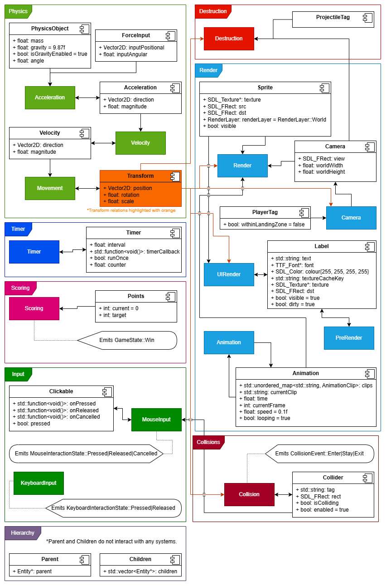

# Martian Miner

## Engine Overview

As part of our studies in the BCIT BScACS Game Development program, we had the opportunity to develop a 2D game engine from scratch in C++. 
Our game engine leveraged concepts introduced in the lecture materials to create a pure Entity Component System (ECS) architecture.
The engine has been extended by adding modules to support 2D physics, such as an acceleration system and a physics object component, as well as modules for UI elements to manage menus, HUD components, and other interface features.
By expanding on the ECS structure covered in class, we can create a modular and flexible engine that meets the specific gameplay and technical requirements of our project.

## System Overview

## Gameplay

### Overview

Players operate from inside a mining spaceship above the Martian surface.
They are tasked with mining valuable resources on the planet's surface, requiring the player to land and take off multiple times.
While navigating between excavation sites, players will have to avoid asteroids, which, if collided with, result in an automatic loss.

### Sales Pitch

Calling all miners! 
Martian Miner blasts the classic Lunar Lander formula into a whole new orbit. 
Strap into your rocket and descend onto the dusty Martian surface, navigating to scattered mining sites to collect valuable resources and rack up an astronomical high score.

But hold onto your helmet. 
What’s this? 
Systems red! 
Asteroids are raining down from above! 
You’ll need steady thrusters and nerves of steel to pilot your ship through Mars’s treacherous skies. 
One wrong move, one unlucky hit, and your ship and your hard-earned haul will be spaced out into the void.

Think you’ve got the right stuff to conquer the Red Planet? 
Suit up and play Martian Miner today!

### Narrative

In the far future, as humanity spreads through the solar system, the demand for resources increases exponentially. 
Miners like the player are those tasked with dropping to a planet's surface to extract valuable minerals and return them to orbiting refineries. 
The work is dangerous and considered highly undesirable; it is done only by those desperate enough for money.

### Art Sourcing
Martian Miner uses a pixel art aesthetic to deliver a classic 2D gameplay experience. 
While inspiration for the visual style may have come from online sources, all game assets have been created by hand by the two developers, ensuring a cohesive, original look for the game.

## High Level Features

### Asteroid and Surface Collisions

The game features asteroids that can collide with the player’s ship, immediately ending the game and resulting in the player’s defeat. 
Collisions with the Martian surface at unsafe speeds or angles also cause the player to crash.

### Physics-Based Ship Movement with Rotation

Players control a spacecraft equipped with a single thruster, resulting in physics-based movement influenced by gravity and momentum. 
The ship also can rotate freely through a full 360 degrees, requiring careful control to land safely.

### Resource Collection

Players must collect resources from designated mining locations on the Martian surface in order to complete the level.

### User Interface Screens

The game will include simple, themed user interface screens that allow players to navigate the application, including menus and displays of gameplay information.
